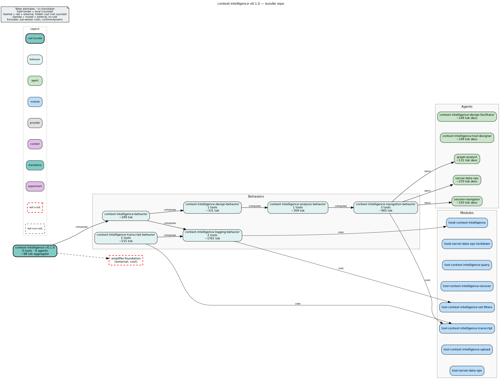

<h1 align="center">amplifier-bundle-context-intelligence</h1>

<p align="center">
  <a href="#quick-start">Quick start</a> &nbsp;&bull;&nbsp;
  <a href="#agents">Agents</a> &nbsp;&bull;&nbsp;
  <a href="#what-gets-stored">Architecture</a> &nbsp;&bull;&nbsp;
  <a href="docs/configuration-reference.md">Configuration</a> &nbsp;&bull;&nbsp;
  <a href="docs/troubleshooting.md">Troubleshooting</a>
</p>

<p align="center">
  <a href="https://github.com/microsoft/amplifier-bundle-context-intelligence/actions/workflows/ci.yml"></a>
  <a href="LICENSE"></a>
</p>

---

**Adding context intelligence to an Amplifier project?** Tell your coding agent:

```
Add amplifier-bundle-context-intelligence to this project so my sessions are captured for analysis.
Start here: https://github.com/microsoft/amplifier-bundle-context-intelligence#quick-start
```

**`amplifier-bundle-context-intelligence`** is an [Amplifier](https://github.com/microsoft/amplifier) bundle that captures session events as structured data for analysis and querying.

The bundle writes every session event to a local JSONL log and — when one or more **destinations** are configured — fans those events out to one or more [Context Intelligence Server](https://github.com/microsoft/amplifier-context-intelligence) instances for graph storage and blob management. Each session is routed to every destination whose `.gitignore`-style include/exclude patterns match the session's working directory, so different projects can flow to different servers (or to none) while local capture always happens.

## What it does

| Always active | When one or more `destinations` are configured |
|---------------|------------------------------------------------|
| Writes `events.jsonl` + `metadata.json` per session, both tagged with `workspace` | Fans each session's events out to every destination whose include/exclude patterns match the session's working directory |
| | Enables graph-powered Cypher queries via `graph_query` tool |
| | Enables `blob_read` tool for resolving `ci-blob://` URIs |

Two agents are included for querying session data:

- **`graph-analyst`** — primary entry point. Queries the context-intelligence property graph using Cypher, resolves `ci-blob://` URIs, and automatically delegates to `session-navigator` when the graph server is unreachable or returns 0 sessions.
- **`session-navigator`** — local fallback agent. Navigates session data via flat JSONL files using safe `bash`/`jq`/`grep` extraction patterns when the server is unavailable. Invoked only by `graph-analyst` via the delegation chain — external callers should use `graph-analyst` as the entry point.

A **`/context-intelligence` mode** is also included for building new context intelligence-aware tooling. Activate it to enter a design workspace where you can investigate session data, explore the graph model, and produce reusable Amplifier components (skills, agents, context files, recipes, CLIs) for your project.

### Composition — pick the layer you need

The bundle ships as **composable layered behaviors** rather than one monolith. Richer layers `include` the lighter ones, so you compose only what you need:

| Behavior | Adds | Use when |
|----------|------|----------|
| `context-intelligence-logging` | the telemetry hook only (event capture + optional server fan-out) | you want **pure session telemetry/logging** — no agents, tools, skills, or mode |
| `context-intelligence-navigation` (Layer 1) | `session-navigator` (reads raw JSONL on disk; no graph server) | local/offline navigation fallback only |
| `context-intelligence-analysis` (Layer 2) | `graph-analyst` + graph/query skills + the query tools (⊃ navigation) | graph read/query/exploration, no design mode |
| `context-intelligence-design` (Layer 3) | the `/context-intelligence` design mode (⊃ analysis) | full read/query **plus** the tooling-design workflow |
| `context-intelligence` (umbrella) | `design` **+** `logging` together | the full drop-in: read/query/design **and** session instrumentation |

The umbrella `context-intelligence.yaml` is the drop-in install (Quick start below). Reach for a single layer when an integrator needs something leaner — e.g. compose `context-intelligence-logging` into an app that only needs telemetry, with zero analysis/skill machinery.

## Quick start

### 1. Install

**Add to an existing app** (recommended) — layers the behavior on top of your active bundle without pulling in foundation as a dependency:

```bash
amplifier bundle add git+https://github.com/microsoft/amplifier-bundle-context-intelligence@main#subdirectory=behaviors/context-intelligence.yaml --app
```

**Standalone** — creates a dedicated session configuration using the full root bundle (includes foundation):

```bash
amplifier bundle add git+https://github.com/microsoft/amplifier-bundle-context-intelligence@main
amplifier bundle use context-intelligence
```

Every Amplifier session will now write events to local JSONL files automatically — no server required.

### 2. (Optional) Forward events to one or more servers

To push events to the [Context Intelligence Server](https://github.com/microsoft/amplifier-context-intelligence) for graph storage and querying, you need a running server instance and its API key. See the [server repository](https://github.com/microsoft/amplifier-context-intelligence) for setup instructions.

Forwarding is configured with **`destinations`** — a named map of servers, each routed by `.gitignore`-style patterns on the session's working directory. Put the secret in `~/.amplifier/keys.env` (loaded automatically, never committed) and reference it from `~/.amplifier/settings.yaml`:

```bash
# ~/.amplifier/keys.env  — secrets only, never commit
MAIN_CI_KEY=<your-api-key>
```

```yaml
# ~/.amplifier/settings.yaml
overrides:
  hook-context-intelligence:
    config:
      destinations:
        main:
          url: "http://localhost:8000"
          api_key: "${MAIN_CI_KEY}"      # resolved from keys.env before it reaches the hook
          include: ["**"]                # every session (the default)
```

That single-destination block is the common case. To route different projects to different servers — or to exclude some entirely — add more named destinations; for the full routing model and pattern rules, see [Server forwarding — `destinations`](docs/configuration-reference.md#server-forwarding--destinations) in the Configuration reference.

> **Never write a literal API key into `settings.yaml`.** That file is version-controllable configuration; a secret written there is one accidental commit away from exposure. Always reference it via `${VAR}` from `keys.env`.

### 3. Verify

After running a session:

```bash
ls ~/.amplifier/projects/<project_slug>/sessions/*/context-intelligence/
# events.jsonl  metadata.json

head -1 ~/.amplifier/projects/<project_slug>/sessions/*/context-intelligence/events.jsonl | jq .workspace
cat ~/.amplifier/projects/<project_slug>/sessions/*/context-intelligence/metadata.json | jq .workspace
```

If the server is configured, open `http://localhost:8000/dashboard` — your session will appear once authenticated.

### What to try next

Once you're set up, [`docs/context-intelligence-exploration-guide.md`](docs/context-intelligence-exploration-guide.md) is a curated list of things to explore — verifying the connection, testing session capture, querying the graph, and more. Not a formal test plan; more "here's what's interesting."

## Use it from your code

When integrating this hook from Python rather than through the bundle CLI, call `mount()` directly:

```python
from amplifier_module_hook_context_intelligence import mount

# async def mount(coordinator, config: dict) -> cleanup_fn
cleanup = await mount(coordinator, config={})
# ... session runs ...
await cleanup()
```

With an empty config dict the hook resolves everything from `coordinator.config` and the working-directory slug. `mount()` returns an async cleanup coroutine that **must** be awaited when the session ends — it drains in-flight HTTP dispatches and closes the persistent HTTP client.

For the full config dict, runtime workspace injection, accessing resolved values, and every tuning knob, see [**Embedding in an Amplifier application**](docs/configuration-reference.md#embedding-in-an-amplifier-application) in the Configuration reference.

## Agents

| Agent | Available | Tools | Role |
|-------|-----------|-------|------|
| `graph-analyst` | Always | `graph_query`, `blob_read`, `tool-filesystem`, `tool-bash`, `tool-skills` | Primary entry point — graph-powered analysis via Cypher across all three data layers, blob resolution, automatic fallback |
| `session-navigator` | Always (via delegation) | `tool-filesystem`, `tool-search`, `tool-bash`, `tool-skills` | Local fallback — safe JSONL navigation via bash/jq/grep; invoked by graph-analyst when the server is unreachable |
| `context-intelligence-design-facilitator` | `/context-intelligence` mode only | `tool-skills` | Design guide — domain elicitation and component design facilitation for building new context intelligence-aware tooling |

**Delegation chain:** External callers always invoke `graph-analyst`. If the server is unreachable or the workspace contains 0 sessions, it delegates to `session-navigator`, which navigates local JSONL files using safe extraction patterns. `session-navigator` is never invoked directly.

The `context-intelligence-design-facilitator` is a conversational design guide available only when the `/context-intelligence` mode is active. It asks questions to understand the user's domain, maps that domain to context intelligence data layers, and helps design the right Amplifier component shape (skill, agent, recipe, CLI, etc.) for the investigation findings. It delegates investigation to `graph-analyst` and component authoring mechanics to ecosystem experts (`foundation:foundation-expert`, `recipes:recipe-author`).

See [`context/safe-extraction-patterns.md`](context/safe-extraction-patterns.md) for JSONL navigation patterns.

## Context Intelligence design mode

Activate with `/context-intelligence` (or `/mode context-intelligence`).

The design mode is an opt-in workspace for building new context intelligence-aware Amplifier components and standalone tools. It adds the `context-intelligence-design-facilitator` agent on top of the always-active bundle capabilities — nothing existing is removed or hidden.

### What it does

The mode supports an investigate → design → produce lifecycle:

1. **Investigate** — use `graph-analyst` (graph-powered, all three data layers) and `session-navigator` (local JSONL fallback) to understand what context intelligence can already observe about the target runtime
2. **Design** — the facilitator asks domain questions (what events does the runtime emit? what behaviors are invisible today? what would be valuable to observe?), maps findings to data layers, and recommends the right output shape
3. **Produce** — create reusable components: skills, context files, agents, recipes, docs, agent tool modules, or standalone CLI tools

### Tool policies in the mode

| Tool | Policy |
|------|--------|
| `graph_query`, `blob_read`, `read_file`, `glob`, `grep` | Safe — always allowed |
| `write_file`, `edit_file` | Warn — first call blocked with a reminder; retry proceeds |
| `bash` | Blocked — the mode processes potentially untrusted session data |

### What the mode produces

The output shape depends on the user's needs. Anything produced is **vendored into the consuming project** — not shipped in this bundle. The consuming project owns updates when the context intelligence schema changes.

| Shape | When to use |
|-------|-------------|
| Skill | Reusable Cypher query pattern or JSONL extraction pattern |
| Context file | Domain-specific awareness injected into project agents |
| Agent | Specialist that investigates a specific runtime |
| Recipe | Repeatable multi-step investigation or analysis workflow |
| CLI tool | Standalone investigation utility outside Amplifier sessions |
| Agent tool module | Production Amplifier tool wrapping a verified pattern |
| Docs | Captured forensic findings, query guides, schema notes |

### Accumulating project context

Save investigation findings to `.amplifier/context-intelligence/` in your project. The mode auto-scans `.md` files there (up to 50KB) on entry, making accumulated project-specific knowledge available across sessions.

See [`context/dual-path-library-template.md`](context/dual-path-library-template.md) for the library template that every generated tool should follow, and [`context/jsonl-event-schema.md`](context/jsonl-event-schema.md) for the events.jsonl schema contract.

## What gets stored

<p align="center"></p>

### Local files (always)

```
<base_path>/<project_slug>/sessions/<session_id>/context-intelligence/
├── events.jsonl    ← one JSON line per event, each tagged with workspace
└── metadata.json   ← session lifecycle record, also tagged with workspace
```

`events.jsonl` record schema — fields in order:

```
event      string   — event name, e.g. "session:start", "tool:call"
workspace  string   — isolation scope (empty string if not configured)
timestamp  string   — ISO 8601 timestamp from event data
data       object   — full sanitized event payload
```

`metadata.json` schema:

```
format      string   — always "context-intelligence"
version     string   — always "1.0.0"
session_id  string
workspace   string   — same value as in events.jsonl
parent_id   string   — empty if root session
started_at  string
status      string   — "running" → "completed" / "failed"
ended_at    string   — set on finalisation
working_dir string
```

Optional fields (present only when set): `agent_name`, `parallel_group_id`, `recipe_name`, `recipe_step`.

### Server-side graph (when server configured)

All graph building, Neo4j writes, and blob management happen in the CI server.
See [`context/graph-model-reference.md`](context/graph-model-reference.md) for the Neo4j graph model.

## Configuration

Local capture works with **zero configuration**. Everything beyond the [Quick start](#quick-start) — server forwarding, authentication (static keys and Microsoft Entra), workspace resolution, embedding from Python, dispatch/timeout tuning, and the read-path query contract — lives in one place:

**→ [Configuration & Integration Reference](docs/configuration-reference.md)**

Forwarding warnings map to precise causes. See [`docs/troubleshooting.md`](docs/troubleshooting.md) for the symptom → cause → fix guide, [`docs/remote-server-troubleshooting.md`](docs/remote-server-troubleshooting.md) for remote / Azure-deployed servers, and [`docs/container-dns-troubleshooting.md`](docs/container-dns-troubleshooting.md) when a session runs **inside a DTU / Incus container** and can't reach the server.

## Documentation

| Document | Covers |
|----------|--------|
| [**README**](#quick-start) | **Start here** — what it is, install, verify, agents, architecture. |
| [Configuration & Integration Reference](docs/configuration-reference.md) | Every config key: `destinations`, auth modes, workspace resolution, embedding from Python, dispatch tuning, read-path contract. |
| [Exploration guide](docs/context-intelligence-exploration-guide.md) | What's worth trying after setup — a curated tour, not a test plan. |
| [Troubleshooting](docs/troubleshooting.md) | Forwarding warnings: symptom → cause → fix. |
| [Remote / Azure troubleshooting](docs/remote-server-troubleshooting.md) | APIM, Entra, tuning, the auth probe cookbook, recovering undelivered events. |
| [Container DNS troubleshooting](docs/container-dns-troubleshooting.md) | Reaching the server from inside a DTU / Incus container. |
| [Graph exploration walkthrough](docs/examples/graph-exploration-walkthrough.md) | Worked example: mining "how do we actually work?" from the graph. |
| [`context/` reference material](context/) | Domain reference loaded by agents/skills at runtime — event schema, graph model, extraction patterns. |

The `docs/` directory holds human-facing operational docs (this table); the `context/` directory holds agent-loaded domain reference material. See [`docs/README.md`](docs/README.md) for the full index and the split between the two.

## Repository structure

```
amplifier-bundle-context-intelligence/
├── bundle.md                           ← root bundle definition
├── bundle.dot / bundle.png             ← generated bundle structure diagram
├── behaviors/                          ← composable layered behaviors (compose what you need)
│   ├── context-intelligence-navigation.yaml  ← Layer 1: session-navigator only
│   ├── context-intelligence-analysis.yaml    ← Layer 2: + graph-analyst + query tools (⊃ navigation)
│   ├── context-intelligence-design.yaml      ← Layer 3: + design mode (⊃ analysis)
│   ├── context-intelligence-logging.yaml     ← orthogonal: telemetry hook only
│   └── context-intelligence.yaml             ← umbrella: design + logging (full drop-in)
├── modes/
│   └── context-intelligence.md  ← design-time mode
├── agents/
│   ├── graph-analyst.md  ← primary entry point agent
│   ├── session-navigator.md      ← local fallback agent
│   └── context-intelligence-design-facilitator.md  ← design guide agent (mode only)
├── context/                            ← domain reference loaded by agents/skills at runtime
│   ├── event-schema.md                 ← all 51+ Amplifier events
│   ├── graph-model-reference.md        ← Neo4j graph model for Cypher queries
│   ├── safe-extraction-patterns.md     ← JSONL navigation patterns
│   ├── config-resolution.dot           ← HookConfigResolver fallback chain diagram
│   ├── session-disk-layout.dot         ← on-disk session directory structure
│   ├── delegation-strategy.dot         ← graph-analyst → session-navigator delegation logic
│   ├── agents/
│   │   └── session-storage-knowledge.md
│   ├── dual-path-library-template.md      ← copy-paste library template for dual-path tools
│   └── jsonl-event-schema.md               ← events.jsonl schema contract
├── modules/
│   ├── hook-context-intelligence/      ← the Python hook module — PURE TELEMETRY
│   └── tool-context-intelligence-query/ ← graph_query + blob_read tools
│       └── amplifier_module_tool_context_intelligence_query/
│           ├── graph_query_tool.py     ← Cypher query tool
│           └── blob_read_tool.py       ← ci-blob:// resolution tool
├── docs/                               ← human-facing operational docs (see docs/README.md)
│   ├── README.md                       ← documentation index
│   ├── configuration-reference.md      ← full configuration & integration reference
│   ├── context-intelligence-exploration-guide.md   ← what to explore and how to test
│   ├── troubleshooting.md              ← forwarding warnings: symptom → cause → fix
│   ├── dispatch-circuit-breaker.dot    ← dispatch flow and circuit breaker state machine
│   └── logging-handler-flow.dot        ← thin forwarder architecture
├── skills/
│   ├── context-intelligence-graph-query/  ← vendored statically (real body + no-server block)
│   ├── context-intelligence-session-navigation/
│   └── …                               ← additional graph/design skills
└── tests/
```

## Development

```bash
# Module tests
cd modules/hook-context-intelligence
uv sync
uv run pytest tests/ -q

# Bundle-level tests
uv run pytest ../../tests/ -q

# YAML validation — requires pyyaml (not installed by default in the bundle virtualenv)
# Install pyyaml first if the command fails with "No module named 'yaml'":
#   pip install pyyaml   OR   uv pip install pyyaml
uv run python -c "
import yaml; from pathlib import Path
data = yaml.safe_load(Path('behaviors/context-intelligence.yaml').read_text())
[print(f'  - {t[\"module\"]}') for t in data.get('tools', [])]
[print(f'  - {h[\"module\"]}') for h in data.get('hooks', [])]
print('YAML validates OK')
"
```

Contributors: see [`CONTRIBUTING.md`](CONTRIBUTING.md) for the dev workflow and [`AGENTS.md`](AGENTS.md) for this repo's load-bearing rules (validator false positives, testing gates, seam awareness).

## Related

- [amplifier-context-intelligence](https://github.com/microsoft/amplifier-context-intelligence) — the CI server (Neo4j + blob storage + dashboard)
- [amplifier-app-cli](https://github.com/microsoft/amplifier-app-cli) — CLI that sends `project_slug` used for workspace resolution
- [amplifier](https://github.com/microsoft/amplifier) — the Amplifier framework

## Contributing

> [!NOTE]
> This project is not currently accepting external contributions, but we're actively working toward opening this up. We value community input and look forward to collaborating in the future. For now, feel free to fork and experiment! For the developer workflow, see [`CONTRIBUTING.md`](CONTRIBUTING.md).

Most contributions require you to agree to a
Contributor License Agreement (CLA) declaring that you have the right to, and actually do, grant us
the rights to use your contribution. For details, visit [Contributor License Agreements](https://cla.opensource.microsoft.com).

When you submit a pull request, a CLA bot will automatically determine whether you need to provide
a CLA and decorate the PR appropriately (e.g., status check, comment). Simply follow the instructions
provided by the bot. You will only need to do this once across all repos using our CLA.

This project has adopted the [Microsoft Open Source Code of Conduct](https://opensource.microsoft.com/codeofconduct/).
For more information see the [Code of Conduct FAQ](https://opensource.microsoft.com/codeofconduct/faq/) or
contact [opencode@microsoft.com](mailto:opencode@microsoft.com) with any additional questions or comments.

## Trademarks

This project may contain trademarks or logos for projects, products, or services. Authorized use of Microsoft
trademarks or logos is subject to and must follow
[Microsoft's Trademark & Brand Guidelines](https://www.microsoft.com/legal/intellectualproperty/trademarks/usage/general).
Use of Microsoft trademarks or logos in modified versions of this project must not cause confusion or imply Microsoft sponsorship.
Any use of third-party trademarks or logos are subject to those third-party's policies.
