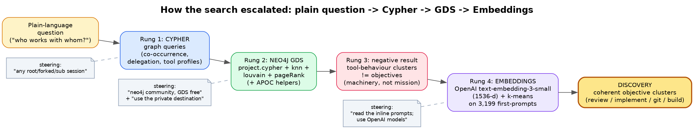
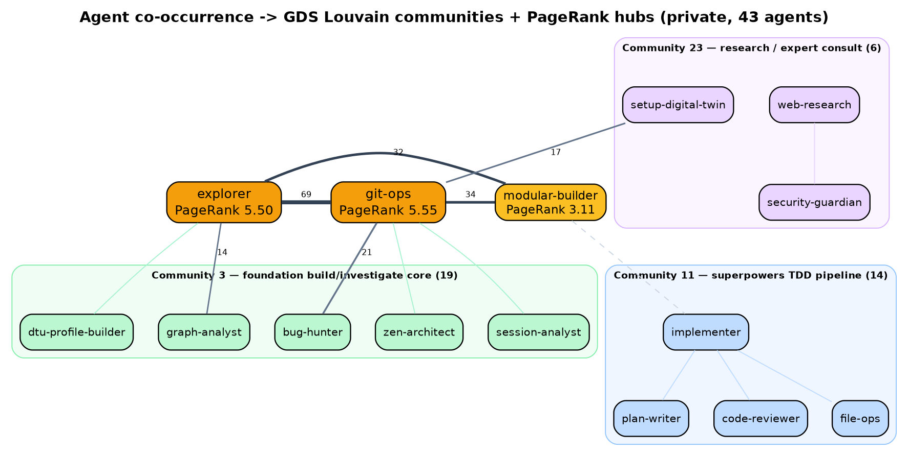
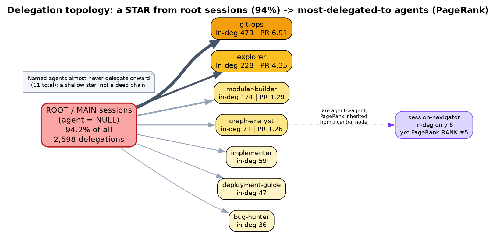
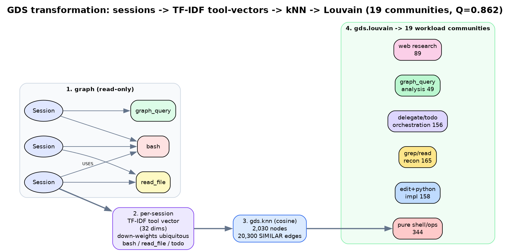
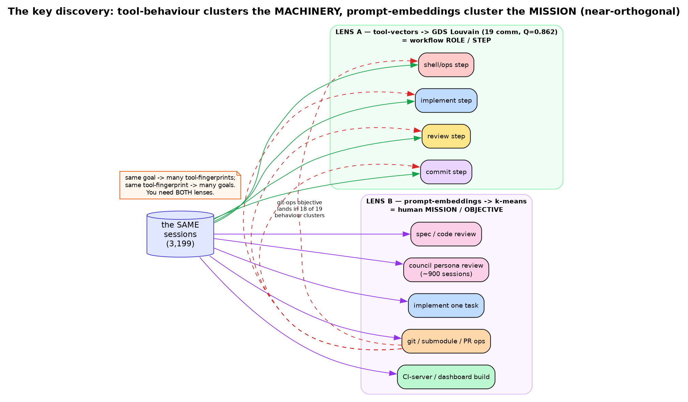

# Example: Mining "how do we actually work?" from the Context-Intelligence graph

> **What this is.** A worked, end-to-end example of using **context-intelligence** as an
> analytics substrate over your own Amplifier history — starting from a plain-language
> question, escalating through graph queries → **Neo4j GDS** graph algorithms → **LLM
> embeddings for semantic clustering**, and ending at a discovery none of the individual
> steps could reach alone.
>
> It is meant as a template for **what to ask** and **what context-intelligence can do**. It
> pairs with the [`context-intelligence-gds`](../../skills/context-intelligence-gds) skill (the
> reusable *procedure*) and [`context-intelligence-exploration-guide.md`](../context-intelligence-exploration-guide.md)
> (the *how-to*) — this doc is the worked *narrative* that shows them in action end to end.

---

## TL;DR — the discovery

Two very different notions of "similar sessions" fall out of the same graph, and they are
**near-orthogonal**:

- **By tool behaviour** (which tools a session calls, and in what chains) sessions cluster by
  **workflow ROLE / step** — *implement-step*, *review-step*, *commit-step*. GDS Louvain found
  **19 clean communities at modularity Q = 0.862**.
- **By objective** (what the opening prompt actually asks for, via embeddings) sessions cluster
  by **MISSION** — *spec review*, *council review*, *git/submodule ops*, *CI-server build*.

> **The punchline:** *tool-vectors cluster the machinery; prompt-embeddings cluster the mission.*
> In an agent-orchestrated workflow one human objective ("ship this bundle") fans out into
> implement/review/commit sub-steps whose tool fingerprints are fixed by **role**, not **goal** —
> so behaviour-similarity and objective-similarity measure different things. You need both lenses,
> and the graph carries the data for both.

---

## Visualising the transformations

Each rung reshapes the same session data into a different grouping. The DOT sources and rendered
PNGs live in [`exploration-diagrams/`](./exploration-diagrams/).

**1. How the search escalated** — one question at a time, each needing a stronger tool than the
last; the human steering (dashed notes) is what redirected each rung.

**2. Agent co-occurrence → GDS communities + PageRank hubs** — who works with whom. `git-ops` and
`explorer` are connective hubs (top PageRank); Louvain splits the rest into a foundation
build/investigate core and a superpowers TDD pipeline.

**3. Delegation topology** — a shallow **star from the root session** (94% of delegations), not a
deep agent-delegates-agent chain. PageRank surfaces `session-navigator` (rank #5 on only 6
delegations — importance inherited from a central delegator).

**4. The GDS session-clustering transformation** — the read-only graph is projected
(`gds.graph.project.cypher`) into per-session TF-IDF tool-vectors → `gds.knn` similarity graph →
`gds.louvain` communities (19 workloads, Q = 0.862).

**5. The key discovery — machinery vs mission** — the *same* sessions clustered two ways are
near-orthogonal: tool-vectors cluster the workflow ROLE/step; prompt-embeddings cluster the human
MISSION. One objective (git-ops) scatters across 18 of 19 behaviour clusters (red dashed).

---

## The corpus explored

Two live context-intelligence servers were queried (read-only surface, `source` provenance
recorded on every result):

| Server | Sessions | Tool calls | Distinct agents | Delegations | Notes |
|---|---:|---:|---:|---:|---|
| **team-shared** (`…azure-api.net/context-intelligence`) | ~2,065 | ~42,450 | 52 | 1,696 | multi-user; APIM-fronted; `/cypher` **read-only** |
| **private-home-server** (`localhost:8000`) | ~3,375 | 56,653 | 44 | 2,598 | single-user; Neo4j Community + **GDS free**; read-only store but **usable GDS in-memory catalog** |

The final semantic pass embedded **3,199 first-prompts** (866 root / 2,333 delegated sub-sessions;
median prompt length ~4,150 chars).

---

## How the search started, and how it escalated

It began as a simple curiosity and deepened one question at a time. Each rung needed a stronger
tool than the last — which is the real lesson of the example.

### Rung 1 — plain graph queries (Cypher)
**Q: "What are the most common sets of agents used together in sessions?"**
Group `Delegation` nodes by `parent_session_id`, collect the distinct agents per session, count
co-occurring pairs/triples.
- **Finding:** a **"build core" triad** — `foundation:explorer` + `foundation:git-ops` +
  `foundation:modular-builder` — recurs far more than any other (the explore → implement → commit
  loop). `git-ops` is the near-universal hub.

**Q: "Which agent delegates the most in a single session?"**
- **Finding (and a schema trap):** `Delegation.agent` is the *delegated-TO* agent, not the
  delegator. Joining `parent_session_id → Session.agent` shows **~94% of all delegations are
  issued by the root/main session** (`agent IS NULL`), not by any named agent. The topology is a
  **star from the user's root**, not a deep agent-delegates-agent chain. Top session:
  `3dae554e…` — **100 delegations across 10 distinct agents** in one body of work.

### Rung 2 — GDS graph algorithms (the "better way")
**Q: "How many sessions had very similar behaviour, and what are the workloads? Is there a
better way using GDS?"**

First attempt on **team-shared** hit an honest wall: GDS is *installed* (v2026.05.0, 471
procedures) but every `gds.graph.project` / write returned **HTTP 500** — the APIM `/cypher`
proxy runs in **read-only transaction mode**, and GDS projection needs a writable in-memory
catalog. *(Steering: "this is neo4j community with gds free" — correctly reframing the blocker
as the read-only endpoint, not a licence/edition limit.)*

**Re-run against the private destination** *(steering: "try the same queries with GDS but against
the private destination")* — where GDS's in-memory catalog **does** work even though the store is
read-only. Built every graph with `gds.graph.project.cypher` (derived, **no store writes**):

| Analysis | GDS pipeline | Result |
|---|---|---|
| **Session behaviour clustering** | per-session **TF-IDF tool-vectors** → `gds.knn` (cosine) → `gds.louvain` | **19 communities, Q = 0.862** — strong, clean workload separation |
| **Agent co-occurrence** | derived agent–agent graph → `gds.louvain` + `gds.degree`/`gds.pageRank` | two loose "teams" + `git-ops`/`explorer` as connective hubs (top PageRank 5.5–6.9) |
| **Delegation centrality** | bipartite parent→agent → `gds.pageRank` | confirmed the root-star (94%); PageRank surfaced `session-navigator` (rank 5 on only 6 delegations — inherited importance) |
| **Agent behaviour similarity** | per-agent TF-IDF tool-vectors → `gds.knn` → `gds.louvain` | **9 clusters, Q = 0.61** — shell/ops, plan-build, expert-review, read/explore, pure-reviewers; `graph-analyst` a genuine singleton outlier |

**APOC** was used inside the Cypher projections (`apoc.map.fromPairs` to build per-session
tool-frequency maps, `apoc.coll.sort` to canonicalise agent-sets).

**Honest GDS limits found (not worked around, reported):** `gds.nodeSimilarity` and `gds.fastRP`
require materialised `Tool` nodes for a Session→Tool bipartite — impossible against a read-only
store — so they were **not** run; TF-IDF-weighted `gds.knn` was the faithful substitute (and
TF-IDF is exactly the "down-weight ubiquitous `bash`" job fastRP would have done). Weighted
Louvain `.stats`/`.mutate` also 500'd under the read-only wrapper; `.stream` + scalar `.stats`
were used. Nothing that didn't run was reported as if it had.

### Rung 3 — the key negative result
**Q: "But what were the similar sessions actually trying to do — similar tasks? similar
objectives?"**

Cross-tabbing the tool-behaviour clusters against the *objective* (workspace + first prompt)
showed behaviour-similarity **does not** track objective:
- The same project (`session-preparer-spike`) is a top workspace in **13 of 19** behaviour clusters.
- The same objective scatters: **git-ops lands in 18 of 19** behaviour clusters; "SUBAGENT
  IMPLEMENTATION TASK" splits across 5; "SPEC COMPLIANCE REVIEW" across 8.

Tool behaviour was clustering *how the step was executed*, not *what it was for*.

### Rung 4 — embeddings for semantic clustering (no embedding infra? use OpenAI)
*(Steering: "try reading the inline prompts; I don't have access to embedding models unless you
can work out how to use the models on OpenAI.")*

The graph stores each session's first user prompt **inline** (`Prompt.prompt`) — no blob hop
needed. Pipeline:
1. Export `(session_id, workspace, is_root, agent, prompt)` for **3,199 sessions** read-only from
   the graph to a JSONL file (server-side truncation + newline-strip in Cypher; nothing heavy
   pulled through context).
2. Embed each prompt with **OpenAI `text-embedding-3-small`** (1536-dim, batched).
3. **k-means** cluster (root-only k=16 for human objectives; all k=20), characterise each cluster
   by TF-IDF top terms, workspace mix, and the 3 prompts nearest the centroid.

**This is the step that produced the final discovery** — coherent, human-legible **objective**
clusters that the graph-and-GDS tool analysis had scattered.

---

## The objective map (what people were actually trying to do)

From the 866 **root** sessions (human-initiated goals), the dominant missions on this corpus:

| Objective cluster | ~Sessions | Signature prompt |
|---|---:|---|
| Implement one task (recipe subagent-impl) | ~167 | *"SUBAGENT IMPLEMENTATION TASK … implement ONE specific task"* |
| Continue CI dashboard / admin-UX build | 113 | *"Continue the Context Intelligence dashboard + admin UX design/build"* |
| Bundle hygiene analysis | 88 | *"MODE: ANALYZE … hygiene violations"* |
| Final comprehensive code review | 66 | *"FINAL COMPREHENSIVE CODE REVIEW … the ENTIRE implementation"* |
| Spec-compliance review | 63 | *"SPEC COMPLIANCE REVIEW … verify implementation matches spec"* |
| Free-form server/config debugging | 59 | *"cannot publish events to the CI server, check settings.yaml/keys.env"* |
| Git submodule / branch / push ops | 49 | *"Update the git submodule … to latest main"* |
| Code-quality review / spec-fix | 40 | *"CODE QUALITY REVIEW Stage 2 of 2"* |
| Council: convene the persona panel | 37 | *"You are the concierge. Orchestrate a panel of review lenses…"* |
| Clone repo as submodule + set up workspace | 37 | *"clone … as submodule, then update agents.md"* |
| Rewrite DOT diagram labels | 32 | *"MODE: ARCHITECT … rewriting the labels of a DOT diagram"* |
| TDD / mock-vs-real testing discipline | 28 | (tdd-depth context) |
| Review a specific PR | 26 | *"review carefully PR …/pull/48 and the comments"* |

Across **all 3,199** sessions the single biggest activity family is **multi-persona / council
review** (per-lens "review AS THAT PERSONA" + council cross-examination rounds) — **~900+
sessions**. Objectives cut **across** projects: the same *workflow* (review → implement → commit)
is applied to many different repos.

**Meta-finding about this corpus:** it is almost entirely **Amplifier / context-intelligence
self-development** — building and reviewing the context-intelligence bundle and server itself,
with review work (persona/council/spec/quality) as the dominant motion.

---

## The steering that shaped it (why the human-in-the-loop mattered)

Each correction moved the analysis from "plausible" to "true":

1. **"By session I mean any root or forked or subsession — the one that directs the most agents."**
   Forced the delegator question to treat every session node equally and to prove root-vs-sub with
   a delegation-target test — which is how the 94%-root-star topology surfaced honestly.
2. **"This is neo4j community with gds free."**
   Reframed the GDS failure correctly: not a licence wall, a **read-only-endpoint** wall. Kept us
   from filing a wrong conclusion.
3. **"Try the same queries with GDS but against the private destination."**
   Pointed at the one server whose GDS in-memory catalog is usable — turning "GDS would be better"
   into an actual Q = 0.862 result.
4. **"Try reading the inline prompts; use OpenAI models if you can."**
   The decisive pivot from *machinery* to *mission*. Semantic embedding is what answered the
   original question the tool analysis kept missing.

---

## What this demonstrates context-intelligence can do

- **Answer "how do we actually work?"** from real history — agent teaming, delegation topology,
  tool-usage fingerprints — with **provenance on every result**.
- **Serve as a graph substrate for real graph algorithms** — GDS community detection, KNN, and
  centrality run directly on projected views of the session graph (Community + free GDS is enough).
- **Feed semantic analysis** — inline prompts (and blobs) are the raw material for embedding-based
  **objective** clustering when tool-structure alone is too coarse.
- **Stay honest under constraints** — read-only endpoints, unavailable algorithms, and schema
  traps (`Delegation.agent` = delegated-TO, not delegator) were reported, not papered over.

## Honesty caveats (part of the example)

- **Read-only store** on both servers: GDS projections must be *derived* (`gds.graph.project.cypher`),
  and `nodeSimilarity`/`fastRP` (which need writable `Tool` nodes) could not run.
- **Single-user private corpus** heavily weighted to CI/Amplifier self-development — absolute
  numbers won't generalise; the *method* does.
- **Prompt truncation** to 1,500 chars (~89% of prompts were longer); objectives are usually
  stated up front, but a higher cap is the first lever if edges look muddy.
- **Louvain unavailable on one projection** (500 under the read-only wrapper) → k-means substituted
  on the same normalised vectors (Euclidean-on-normalised ≡ cosine), noted as a faithful stand-in.

---

## Reproducing it

1. **Ask a lens question** in plain language; let the `graph-analyst` translate to Cypher.
2. **Escalate to GDS** on a server with a usable catalog (Neo4j Community + free GDS): derive a
   graph via `gds.graph.project.cypher`, then `gds.knn` + `gds.louvain` (+ `pageRank` for hubs).
   Use **TF-IDF-weighted vectors** to defeat glue-tool (`bash`/`read_file`/`todo`) dominance.
3. **Go semantic** when the question is about *intent*: export inline prompts read-only, embed with
   an LLM embedding model (e.g. OpenAI `text-embedding-3-small`), k-means, and characterise
   clusters by top terms + nearest-centroid exemplars.
4. **Keep the human in the loop** — the steering, not the machinery, is what made the answer true.
